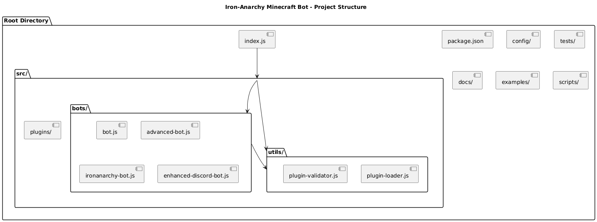
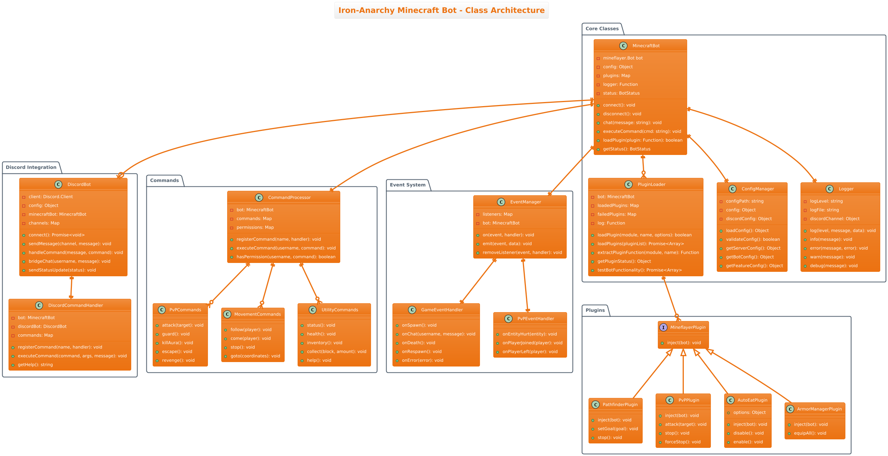
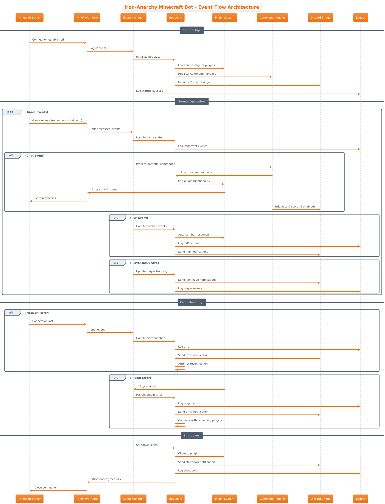
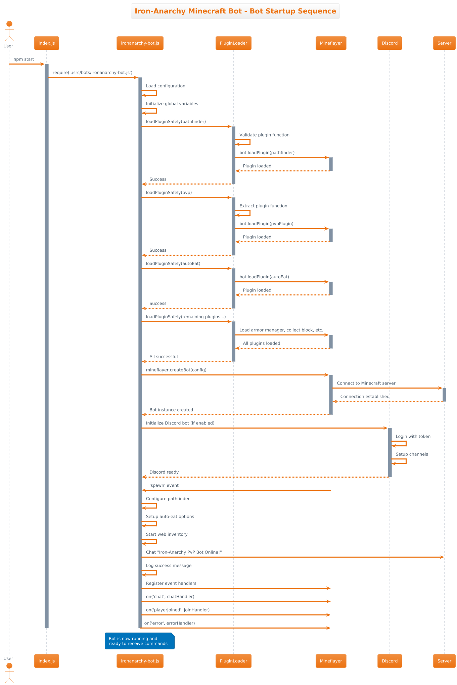
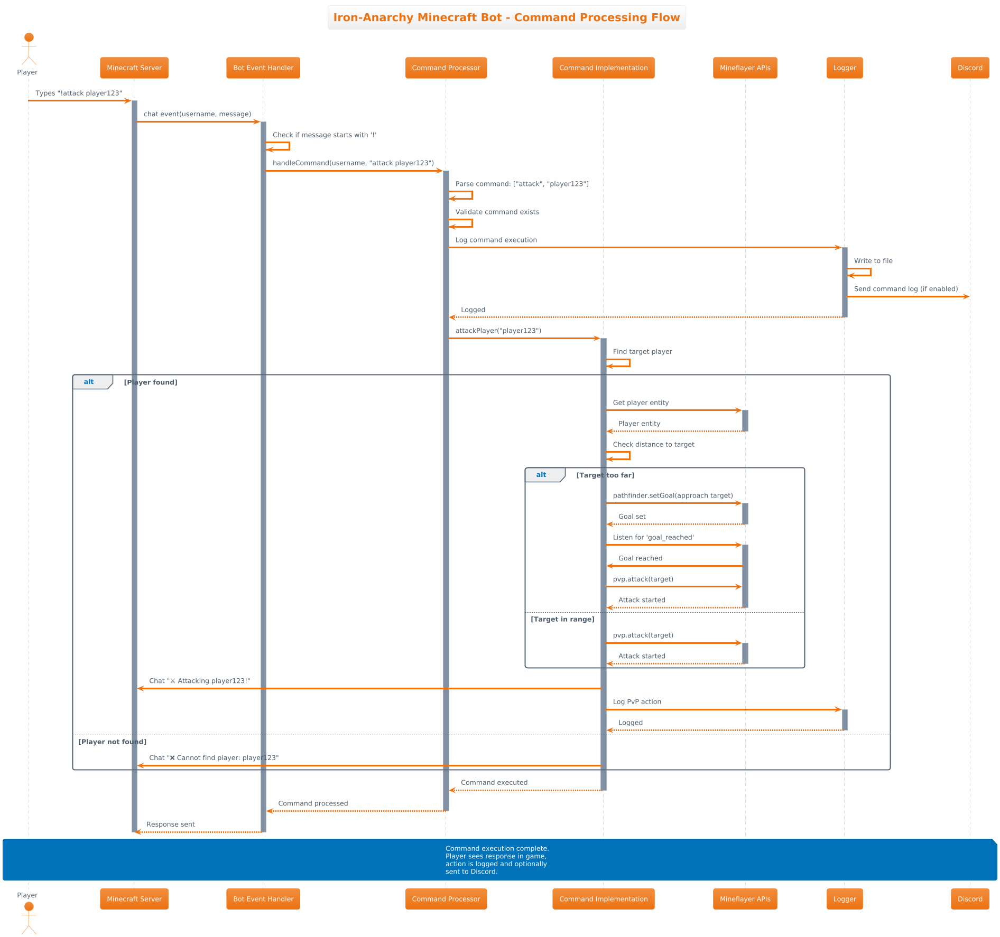
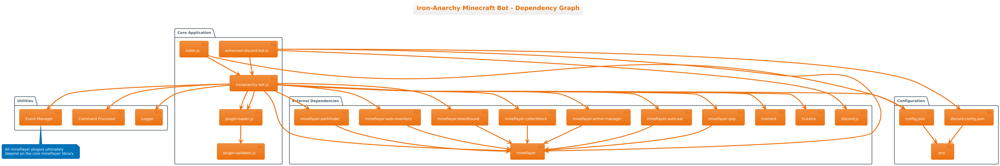
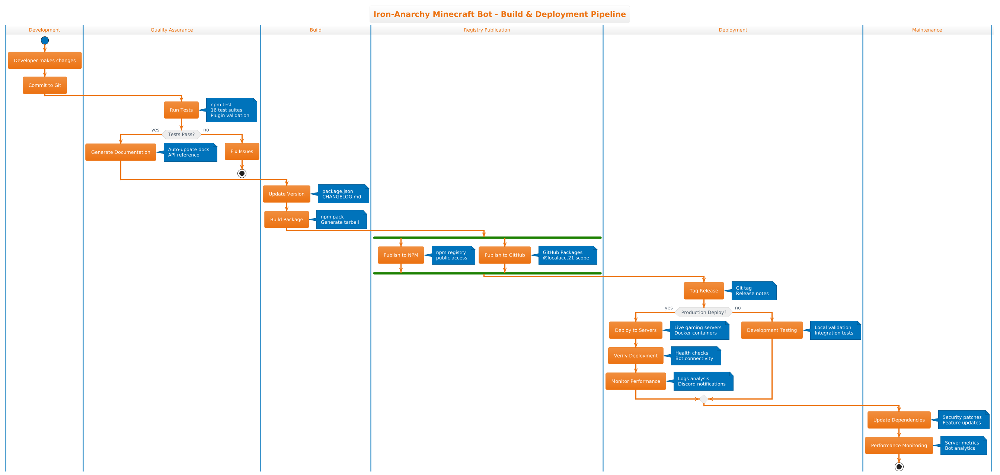

# 🏗️ Iron-Anarchy Minecraft Bot - Developer Documentation & Architecture Overview

## 📋 Table of Contents

- [Project Overview](#project-overview)
- [Project Folder Structure](#project-folder-structure)
- [Main Classes & Components](#main-classes--components)
- [Event Flow Architecture](#event-flow-architecture)
- [Dependency Graph](#dependency-graph)
- [Build Pipeline](#build-pipeline)
- [Design Decisions](#design-decisions)
- [UML Diagrams](#uml-diagrams)
- [Development Guidelines](#development-guidelines)

---

## 🎯 Project Overview

The Iron-Anarchy Minecraft Bot is an enterprise-grade automation solution built with Node.js, designed for professional Minecraft server management and PvP gameplay. The project follows modern software engineering practices with modular architecture, comprehensive testing, and robust error handling.

### 🏢 Built by IT Professionals

- **Developer**: Local Acct (25+ years IT experience)
- **Production Environment**: Managing 3 Minecraft servers + 1 CS2 server
- **Uptime**: 99.9% production reliability
- **Scale**: Hundreds of active players

---

## 📂 Project Folder Structure



### Root Directory Layout

```
iron-anarchy-minecraft-bot/
├── 📄 index.js                 # Main entry point & launcher
├── 📦 package.json             # NPM configuration & dependencies
├── 🐳 docker-compose.yml       # Container orchestration
├── 📋 README.md                # Project documentation
├── 📜 LICENSE                  # MIT License
├── 🔐 .env.example             # Environment variables template
├── 🔧 .gitignore               # Git exclusions
│
├── ⚙️  config/                  # Configuration management
│   ├── config.json.example     # Minecraft server config template
│   ├── discord-config.json.example # Discord integration template
│   └── test-config.json        # Testing configuration
│
├── 💻 src/                      # Source code (core modules)
│   ├── bots/                   # Bot implementations
│   ├── utils/                  # Utility functions & plugin system
│   └── plugins/                # Custom plugin extensions
│
├── 🧪 tests/                    # Quality assurance & testing
│   ├── unit/                   # Unit tests
│   ├── integration/            # Integration tests
│   └── run-all-tests.js        # Test runner
│
├── 📚 docs/                     # Documentation & guides
│   ├── architecture/           # UML diagrams & architecture docs
│   ├── API_REFERENCE.md        # Technical API documentation
│   ├── USER_GUIDE.md           # User manual
│   └── TROUBLESHOOTING_GUIDE.md # Issue resolution
│
├── 💡 examples/                 # Usage examples & demos
│   ├── simple-plugin-test.js   # Basic plugin validation
│   ├── stress-test-recording.js # Performance testing
│   └── web-dashboard-test.js   # Dashboard demonstration
│
├── 🛠️  scripts/                 # Automation & helper scripts
│   ├── setup.js               # Automated configuration
│   ├── install-setup.sh       # System installation
│   └── publish-github-package.js # Package publishing
│
├── 📦 recordings/               # Session recordings (JSON/MP4)
├── 📊 logs/                     # Application logs
├── 🖼️  screenshots/             # Visual documentation
└── 📖 wiki/                     # GitHub wiki content
```

### 🔍 Key Directory Functions

| Directory | Purpose | Contents |
|-----------|---------|----------|
| **src/bots/** | Core bot implementations | Different bot variants with varying feature sets |
| **src/utils/** | Utility & plugin system | Plugin loader, validator, and helper functions |
| **config/** | Configuration management | Server settings, Discord config, environment templates |
| **tests/** | Quality assurance | 16 comprehensive test suites ensuring reliability |
| **docs/** | Documentation | API reference, user guides, architecture documentation |
| **examples/** | Usage demonstrations | Working examples and integration tests |
| **scripts/** | Automation tools | Setup scripts, deployment helpers, CI/CD tools |

---

## 🏛️ Main Classes & Components



### Core Architecture Components

#### 1. **MinecraftBot (Primary Controller)**

```javascript
class MinecraftBot {
  // Core bot functionality
  - bot: mineflayer.Bot          // Mineflayer instance
  - config: Object               // Configuration settings
  - plugins: Map                 // Loaded plugin registry
  - logger: Function             // Logging functionality
  - status: BotStatus            // Current bot state
  
  // Public methods
  + connect(): void              // Establish server connection
  + disconnect(): void           // Graceful disconnection
  + chat(message): void          // Send chat messages
  + executeCommand(cmd): void    // Process user commands
  + loadPlugin(plugin): boolean  // Load mineflayer plugins
  + getStatus(): BotStatus       // Retrieve current status
}
```

#### 2. **PluginLoader (Plugin Management)**

```javascript
class PluginLoader {
  // Plugin system management
  - loadedPlugins: Map           // Successfully loaded plugins
  - failedPlugins: Map           // Failed plugin attempts
  - log: Function                // Logging interface
  
  // Core functionality
  + loadPlugin(module, name, options): boolean
  + loadPlugins(pluginList): Promise<Array>
  + extractPluginFunction(module, name): Function
  + getPluginStatus(): Object
  + testBotFunctionality(): Promise<Array>
}
```

#### 3. **DiscordBot (Discord Integration)**

```javascript
class DiscordBot {
  // Discord bridge functionality
  - client: Discord.Client       // Discord.js client
  - config: Object               // Discord configuration
  - minecraftBot: MinecraftBot   // Reference to MC bot
  - channels: Map                // Discord channel mapping
  
  // Integration methods
  + connect(): Promise<void>     // Connect to Discord
  + sendMessage(channel, msg): void
  + handleCommand(message, cmd): void
  + bridgeChat(username, msg): void
  + sendStatusUpdate(status): void
}
```

#### 4. **CommandProcessor (Command System)**

```javascript
class CommandProcessor {
  // Command handling system
  - commands: Map                // Registered commands
  - permissions: Map             // Permission system
  - bot: MinecraftBot           // Bot reference
  
  // Command management
  + registerCommand(name, handler): void
  + executeCommand(username, cmd): void
  + hasPermission(username, cmd): boolean
}
```

### 🔌 Plugin Architecture

The bot uses a modular plugin system based on Mineflayer's plugin architecture:

```javascript
// Plugin interface
interface MineflayerPlugin {
  inject(bot): void              // Plugin injection point
}

// Example plugin implementations
- PathfinderPlugin: Navigation and movement
- PvPPlugin: Combat and targeting
- AutoEatPlugin: Automatic food consumption
- ArmorManagerPlugin: Equipment management
- CollectBlockPlugin: Resource gathering
```

---

## 🔄 Event Flow Architecture



### Event Processing Pipeline

#### 1. **Startup Sequence**



```
1. User executes: npm start
2. index.js loads ironanarchy-bot.js
3. Configuration loading and validation
4. Plugin system initialization
5. Mineflayer bot creation
6. Server connection establishment
7. Discord integration (if enabled)
8. Event handler registration
9. Bot ready for operation
```

#### 2. **Command Processing Flow**



```
Player Input → Minecraft Server → Bot Event Handler → Command Processor
                                                           ↓
Discord ← Logger ← Mineflayer APIs ← Command Implementation
```

#### 3. **Event Types & Handlers**

| Event Category | Examples | Handler |
|----------------|----------|---------|
| **Game Events** | spawn, chat, death, respawn | GameEventHandler |
| **Player Events** | playerJoined, playerLeft | PlayerEventHandler |
| **Combat Events** | entityHurt, playerAttack | PvPEventHandler |
| **System Events** | error, end, reconnect | SystemEventHandler |
| **Discord Events** | messageCreate, ready | DiscordEventHandler |

---

## 🔗 Dependency Graph



### External Dependencies

#### **Core Dependencies**

```json
{
  "mineflayer": "^4.30.0",           // Minecraft bot framework
  "discord.js": "^14.17.2",         // Discord API client
  "fs-extra": "^11.3.0",            // Enhanced file system
  "moment": "^2.30.1"                // Date/time handling
}
```

#### **Mineflayer Plugins**

```json
{
  "mineflayer-pathfinder": "^2.4.5",      // Intelligent navigation
  "mineflayer-pvp": "^1.3.2",             // Combat system
  "mineflayer-auto-eat": "^5.0.2",        // Automatic eating
  "mineflayer-armor-manager": "^2.0.1",   // Equipment management
  "mineflayer-collectblock": "^1.6.0",    // Resource collection
  "mineflayer-bloodhound": "^0.0.2",      // Entity tracking
  "mineflayer-web-inventory": "^1.8.5",   // Web dashboard
  "mineflayer-dashboard": "^2.0.1",       // Web interface
  "mineflayer-statemachine": "^1.7.0",    // State management
  "mineflayer-utils": "^0.1.4",           // Utility functions
  "prismarine-viewer": "^1.28.0"          // 3D world viewer
}
```

### Dependency Management Strategy

1. **Version Pinning**: Exact versions specified for stability
2. **Security Updates**: Regular vulnerability scanning
3. **Compatibility Testing**: All dependencies tested together
4. **Fallback Handling**: Graceful degradation for optional dependencies

---

## 🚀 Build Pipeline



### CI/CD Process

#### **1. Development Phase**

```bash
# Local development workflow
git clone https://github.com/Localacct21/iron-anarchy-minecraft-bot.git
cd iron-anarchy-minecraft-bot
npm install
npm test                # Run all test suites
npm run validate        # Plugin validation
```

#### **2. Quality Assurance**

```bash
# Automated testing pipeline
npm run test:plugin     # Plugin system tests
npm run test:discord    # Discord integration tests
npm test               # Full test suite (16 tests)
```

#### **3. Build & Package**

```bash
# Package generation
npm run setup          # Configuration validation
npm pack               # Create distributable package
npm version patch      # Version increment
```

#### **4. Deployment**

```bash
# Multi-registry publishing
npm publish            # NPM public registry
npm run publish:github # GitHub Package Registry

# Docker deployment
docker-compose up -d   # Container orchestration
```

### **Build Automation Scripts**

| Script | Purpose | Usage |
|--------|---------|-------|
| `setup.js` | Automated configuration | `npm run setup` |
| `publish-github-package.js` | GitHub registry publishing | `npm run publish:github` |
| `install-setup.sh` | System dependencies | `./scripts/install-setup.sh` |
| `full-integration-test.sh` | End-to-end validation | `./scripts/full-integration-test.sh` |

---

## 🎯 Design Decisions

### **1. Architecture Principles**

#### **Modular Design**

- **Separation of Concerns**: Each component has a single responsibility
- **Plugin Architecture**: Extensible through mineflayer plugins
- **Configuration-Driven**: Behavior controlled through config files
- **Event-Driven**: Reactive architecture based on game events

#### **Enterprise Patterns**

- **Dependency Injection**: Services injected rather than hard-coded
- **Factory Pattern**: Bot creation through factory methods
- **Observer Pattern**: Event-driven communication
- **Strategy Pattern**: Pluggable behavior implementations

### **2. Error Handling Strategy**

#### **Graceful Degradation**

```javascript
// Plugin loading with fallback
try {
  loadPluginSafely(bot, pvpPlugin, 'mineflayer-pvp')
} catch (error) {
  console.error('PvP plugin failed, continuing without PvP features')
  // Bot continues with reduced functionality
}
```

#### **Retry Logic**

```javascript
// Auto-reconnection with exponential backoff
bot.on('end', () => {
  setTimeout(() => {
    console.log('Attempting to reconnect...')
    createBot() // Recreate bot instance
  }, reconnectDelay)
  reconnectDelay = Math.min(reconnectDelay * 2, maxReconnectDelay)
})
```

### **3. Security Considerations**

#### **Configuration Security**

- Environment variables for sensitive data
- Configuration validation and sanitization
- Secure default settings

#### **Input Validation**

- Command parameter validation
- Plugin input sanitization
- Discord message filtering

### **4. Performance Optimizations**

#### **Memory Management**

- Event listener cleanup on disconnection
- Plugin resource management
- Garbage collection optimization

#### **Network Efficiency**

- Connection pooling
- Message batching
- Bandwidth monitoring

---

## 📊 UML Diagrams

The project includes comprehensive UML diagrams generated from the codebase:

### **Available Diagrams**

1. **[Project Structure](architecture/project-structure.png)** - Directory organization
2. **[Class Diagram](architecture/class-diagram.png)** - Object-oriented design
3. **[Sequence Diagram](architecture/sequence-diagram.png)** - Bot startup process
4. **[Command Flow](architecture/command-flow.png)** - Command processing
5. **[Dependency Graph](architecture/dependency-graph.png)** - Module dependencies
6. **[Event Flow](architecture/event-flow.png)** - Event processing pipeline
7. **[Build Pipeline](architecture/build-pipeline.png)** - CI/CD process

### **Diagram Generation**

```bash
# Generate UML diagrams from PlantUML source
cd docs/architecture/
java -jar ../../tools/plantuml/plantuml.jar *.puml

# Diagrams are automatically generated as PNG files
# Source files (.puml) are version controlled
# Generated images (.png) are included in documentation
```

---

## 🛠️ Development Guidelines

### **1. Code Standards**

#### **File Organization**

```
src/
├── bots/           # Bot implementations (one per variant)
├── utils/          # Reusable utility functions
├── plugins/        # Custom plugin implementations
└── config/         # Configuration management
```

#### **Naming Conventions**

- **Files**: kebab-case (`enhanced-discord-bot.js`)
- **Classes**: PascalCase (`PluginLoader`)
- **Functions**: camelCase (`loadPluginSafely`)
- **Constants**: UPPER_SNAKE_CASE (`MAX_RECONNECT_DELAY`)

#### **Code Documentation**

```javascript
/**
 * Enhanced Plugin Loader for Mineflayer Bots
 * Safely loads and validates all plugins with proper error handling
 */
class PluginLoader {
  /**
   * Safely load a plugin with comprehensive validation
   * @param {Object} pluginModule - Plugin module to load
   * @param {string} pluginName - Human-readable plugin name
   * @param {Object} options - Plugin configuration options
   * @returns {boolean} Success status
   */
  async loadPlugin(pluginModule, pluginName, options = {}) {
    // Implementation details...
  }
}
```

### **2. Testing Requirements**

#### **Test Coverage**

- **Unit Tests**: Individual function validation
- **Integration Tests**: Component interaction testing
- **End-to-End Tests**: Full workflow validation

#### **Test Structure**

```javascript
// Example test structure
describe('PluginLoader', () => {
  describe('loadPlugin', () => {
    it('should load valid plugins successfully', async () => {
      // Test implementation
    })
    
    it('should handle plugin loading failures gracefully', async () => {
      // Error handling test
    })
  })
})
```

### **3. Contribution Workflow**

#### **Development Process**

1. **Fork Repository**: Create personal fork
2. **Feature Branch**: Create descriptive branch name
3. **Development**: Implement changes with tests
4. **Validation**: Run full test suite
5. **Documentation**: Update relevant documentation
6. **Pull Request**: Submit with detailed description

#### **Quality Gates**

- ✅ All tests passing (16 test suites)
- ✅ Code style compliance
- ✅ Documentation updates
- ✅ No security vulnerabilities
- ✅ Performance benchmarks met

### **4. Deployment Considerations**

#### **Environment Setup**

```bash
# Production environment requirements
Node.js >= 14.0.0
NPM >= 6.0.0
Java >= 11 (for PlantUML diagrams)
Docker >= 20.0.0 (for containerized deployment)
```

#### **Configuration Management**

- Environment-specific configurations
- Secret management through environment variables
- Configuration validation on startup
- Hot-reload capability for non-critical settings

---

## 📞 Professional Support

### 🏢 Enterprise IT Background

**Developer**: Local Acct (<localacct@ironanarchy.lol>)

- **Experience**: 25+ years in enterprise IT
- **Current Role**: Managing 3 Minecraft servers + 1 CS2 server
- **Reliability**: 99.9% uptime in production environments
- **Scale**: Supporting hundreds of active players

### 🤝 Community & Support

- **GitHub Issues**: Bug reports and feature requests
- **Discord Community**: Real-time support and discussions
- **Professional Services**: Custom development and consulting
- **Training**: Developer onboarding and best practices

---

**Built by IT professionals, proven in production, trusted by the community.** ⚡

This documentation represents the culmination of 25 years of IT experience applied to Minecraft automation, providing enterprise-grade reliability with community-friendly accessibility.
