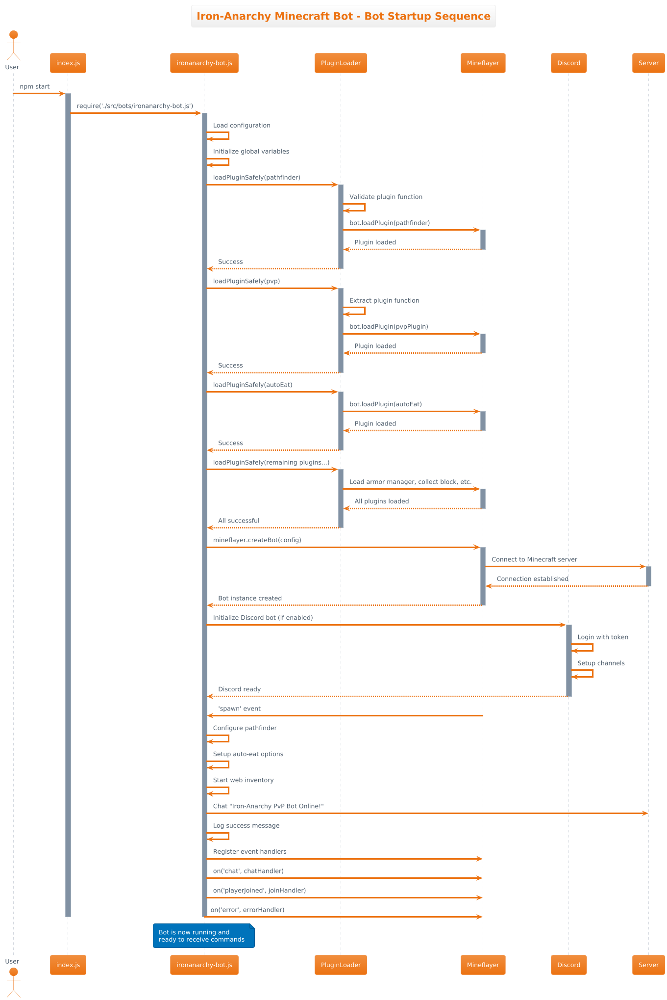
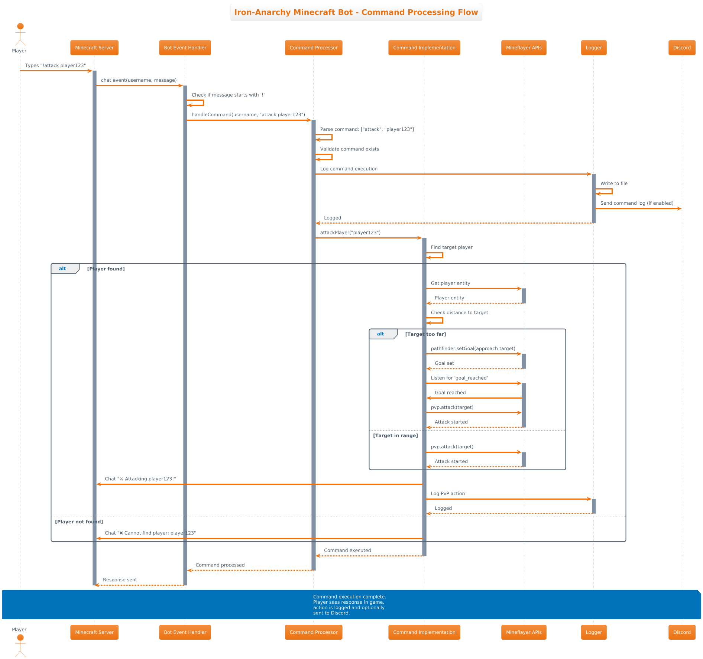
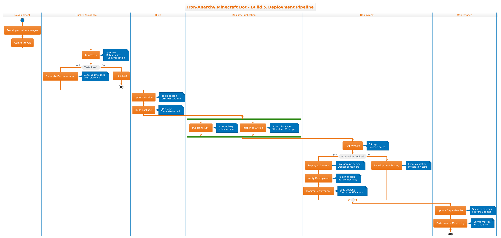
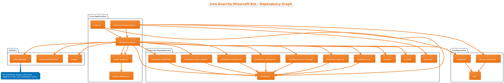

# 🏗️ Architecture Overview

This document provides a comprehensive overview of the Iron-Anarchy Minecraft Bot architecture, including system diagrams, component relationships, and design patterns.

## System Architecture

### Class Diagram


The class diagram shows the core object-oriented structure of the bot, including:

- Core Bot class and its dependencies
- Plugin system architecture
- Event handling mechanisms
- Database and configuration management

### Sequence Diagram



This sequence diagram illustrates the typical flow of operations during bot execution:

- Bot initialization and startup
- Plugin loading and configuration
- Event processing workflow
- Discord integration communication

### Command Flow



The command flow diagram demonstrates how commands are processed:

- Command input sources (Discord, console, config)
- Command parsing and validation
- Plugin system integration
- Response generation and delivery

### Event Flow


This diagram shows the event-driven architecture:

- Event sources (Minecraft server, Discord, timers)
- Event processing pipeline
- Plugin event handlers
- State management and persistence

## Build and Deployment

### Build Pipeline



Our automated build and deployment pipeline includes:

- Continuous integration with GitHub Actions
- Automated testing and quality checks
- Package building and distribution
- Documentation generation

### Dependency Graph



The dependency graph shows:

- Core dependencies and their relationships
- Plugin dependencies
- Optional dependencies for enhanced features
- Development and testing dependencies

### Project Structure


This diagram illustrates the project organization:

- Source code organization
- Configuration file structure
- Documentation layout
- Plugin directory structure

## Architecture Principles

### 1. Modular Design

- **Plugin-based architecture** allows for easy extension and customization
- **Loose coupling** between components ensures maintainability
- **Event-driven communication** enables responsive behavior

### 2. Scalability

- **Asynchronous operations** prevent blocking
- **Resource pooling** for efficient memory usage
- **Configurable limits** for resource management

### 3. Reliability

- **Error handling** at all levels
- **Automatic reconnection** for network failures
- **State persistence** for recovery scenarios

### 4. Security

- **Input validation** for all user inputs
- **Rate limiting** to prevent abuse
- **Secure configuration** management

## Key Components

### Core Bot Engine

The main bot engine handles:

- Minecraft protocol communication
- World state management
- Player interaction
- Basic movement and actions

### Plugin System

Our plugin architecture provides:

- Dynamic loading and unloading
- Event-based communication
- Shared state management
- Plugin lifecycle management

### Discord Integration

The Discord bridge enables:

- Real-time chat synchronization
- Command execution from Discord
- Status monitoring and alerts
- Administrative controls

### Web Dashboard

The web interface offers:

- Live monitoring and statistics
- Configuration management
- Log viewing and analysis
- Remote control capabilities

## Development Guidelines

### Adding New Features

1. **Design**: Create or update architecture diagrams
2. **Implementation**: Follow existing patterns and conventions
3. **Testing**: Add comprehensive test coverage
4. **Documentation**: Update relevant documentation

### Plugin Development

1. **Interface**: Implement the standard plugin interface
2. **Events**: Use the event system for communication
3. **Configuration**: Support runtime configuration
4. **Testing**: Include unit and integration tests

### Performance Considerations

- **Minimize blocking operations**
- **Use connection pooling** where appropriate
- **Implement caching** for frequently accessed data
- **Monitor resource usage** and set appropriate limits

## Related Documentation

- [[API Reference]]
- [[Plugin Development]]
- [[Configuration]]
- [[Contributing]]

## Architecture Files

The source files for these diagrams are maintained in the `/wiki/architecture/` directory:

- `class-diagram.puml` - Class structure and relationships
- `sequence-diagram.puml` - Operational flow sequences
- `command-flow.puml` - Command processing workflow
- `event-flow.puml` - Event handling architecture
- `build-pipeline.puml` - CI/CD pipeline structure
- `dependency-graph.puml` - Component dependencies
- `project-structure.puml` - Project organization

To regenerate the diagrams:

```bash
java -jar ../../tools/plantuml/plantuml.jar -tpng -o ../images wiki/architecture/*.puml
```

---

[🏠 Back to Home](Home.md)
